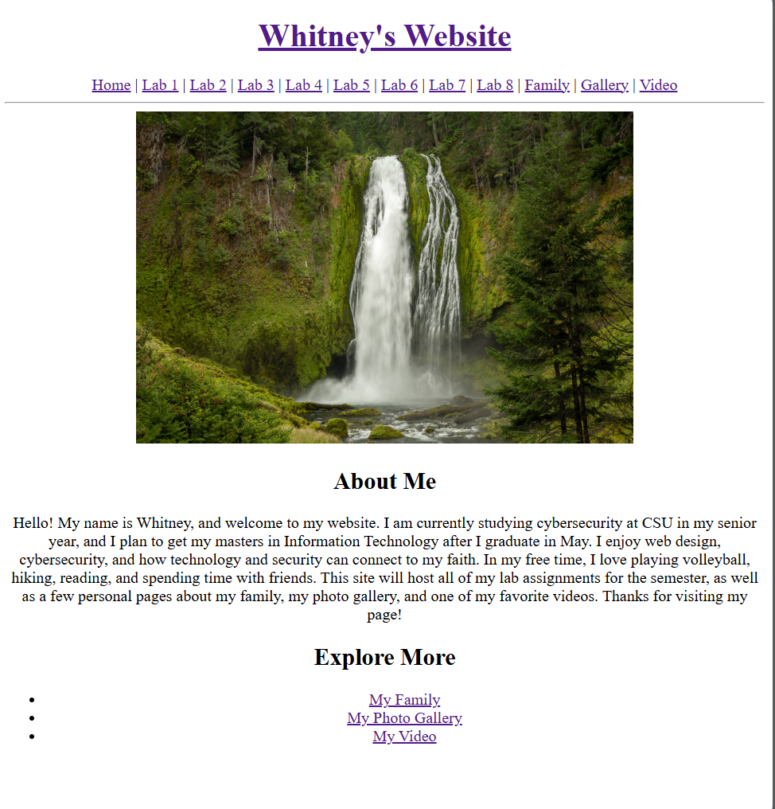

[Back to Portfolio](/index.md)

Creation of a Website that includes information about me and several labs from the Applied Networking course.
===============

-   **Class: CSCI 332** 
-   **Grade: A** 
-   **Language(s): HTML, C++, PHP, CSS** 
-   **Source Code Repository:** [Applied Networking Website](https://github.com/wbcarpenter/CSCI332Website.git)  
    (Please [email me](mailto:wbcarpenter@student.csuniv.edu?subject=GitHub%20Access) to request access.)

## Project description

This project focused on designing and developing a multi-page website using HTML and CSS, with an emphasis on building a strong foundation in front-end web development. The primary objective was to learn how to structure content effectively with HTML and apply styling through CSS to create a clean, consistent, and user-friendly interface.

Throughout the project, I implemented core web design principles such as page layout, navigation structure, spacing, and visual consistency. Special attention was given to organizing content in a logical way and ensuring that all pages maintained a cohesive look and feel. The use of CSS allowed for reusable styling across the site, improving both efficiency and maintainability.

In addition to front-end development, the website also includes several lab components that introduce basic PHP functionality. However, the main focus of the project was developing a solid understanding of how HTML and CSS work together to create responsive and well-structured web pages.  

## How to run the program

This project is hosted using GitHub Pages and can be accessed through a web browser:

### Live Site:

[Whitney's Website](https://wbcarpenter.github.io/CSCI332Website/) 

No installation is required to view the main website.

### Notes on Functionality
- The HTML and CSS components are fully functional through GitHub Pages.
- Some PHP-based labs require a local or server environment (such as XAMPP or a Linux server) to execute properly, as GitHub Pages does not support PHP.
- When run locally with a proper server environment, all lab functionality, including PHP features, operates as intended.

## UI Design

The website follows a simple and consistent design to ensure ease of navigation and readability. A central homepage acts as a table of contents, linking to each lab and section of the site.

Design considerations include:

- Clear navigation between labs and pages
- Consistent layout and styling across all pages
- Logical organization of content into separate folders
- Readable formatting and spacing for user-friendly interaction

The structure allows users to seamlessly move between the homepage and individual lab assignments without confusion.

  
Fig 1. Home page of the website.

## 3. Additional Considerations

One of the primary challenges in this project was managing file paths and navigation across multiple directories, particularly when deploying the site using GitHub Pages. Ensuring that links functioned correctly between pages required a strong understanding of relative and absolute paths.

Another consideration was the limitation of GitHub Pages in supporting server-side languages like PHP. This required designing the site in a way that clearly separates static content from features that must be run in a local or server-based environment.

Overall, this project strengthened my understanding of:

- Website structure and organization
- Front-end development using HTML and CSS
- Basic server-side programming with PHP
- Debugging and resolving deployment issues

[Back to Portfolio](/index.md)