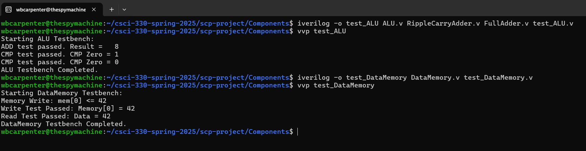

[Back to Portfolio](./index.md)

Single Cycle Processor
===============

-   **Class: Computer Architecture CSCI 330** 
-   **Grade: B+** 
-   **Language(s): Verilog, C** 
-   **Source Code Repository:** [scp-project](https://github.com/wbcarpenter/csci-330-spring-2025/tree/ccf852d0ac97cc8baeaffb8dfe1619b175dfc783/scp-project)  
    (Please [email me](mailto:wbcarpenter@student.csuniv.edu?subject=GitHub%20Access) to request access.)

## Project description

This project focused on understanding how high‑level code is executed on a single‑cycle processor. Starting from a partially provided LC‑style processor framework, I analyzed, tested, and extended the design so that it could correctly execute a loop example and a halt example.

The work was organized into seven tasks:

1. Instruction Analysis: I decoded the loop example machine code into a table including assembly instruction, hex, binary, opcode, description, PC address, register fields, and immediate/offset. This required understanding the instruction format and how each field mapped into the datapath.

2. Loop Purpose & Pseudocode: I described the semantic behavior of the loop program and wrote equivalent high‑level pseudocode, explaining how the processor repeatedly updates registers and branches until a termination condition is met.

3. Addition Count Analysis: Using the decoded machine code, I identified all instructions that caused additions in the processor (both explicit ADDs and implicit additions such as PC updates) and counted how many additions occur during execution.

4. Module Testing (ALU & DataMemory): I wrote Verilog testbenches (test_ALU.v, test_DataMemory.v) to verify the correctness of the provided ALU and DataMemory modules. These tests checked arithmetic correctness, zero flag behavior, and memory read/write operations.

5. HALT Implementation: I implemented HALT support in the SCP by detecting the halt opcode in the control path and terminating the simulation when it is fetched. The behavior is visible in the waveform and console output (e.g., HALT instruction encountered at PC=...).

6. Loop Example Integration: I integrated the components—ProgramCounter, InstructionMemory, ControlROM, RegisterFile, ALU, StatusRegister, DataMemory, and multiplexers—into the top‑level SCP.v module. Using the assembled loop-example.mc, I verified that the processor correctly executed the loop, updated registers, branched using CMP/JE, and eventually reached HALT.

7. Development & Debugging Process: I documented the debugging steps, including verifying control signals, checking ALU operations, confirming register writes, validating branch targets, and using $display statements across modules to trace PC, instructions, register values, and memory accesses.

Overall, this project strengthened my understanding of instruction encoding, datapath design, control logic, and hardware debugging.

## How to compile and run the program

This project uses Icarus Verilog for simulation.

### 1. Assemble the program
The assembler converts .as assembly into .mc machine code:
```bash
gcc assembler.c -o assembler
./assembler loop-example.as loop-example.mc
```

### 2. Run the SCP testbench
Compile all Verilog modules:
```bash
iverilog -o scp_test SCP_Test.v SCP.v InstructionMemory.v \
DataMemory.v RegisterFile.v ALU.v ControlROM.v StatusRegister.v \ MuxTwoOne_32Bit.v MuxTwoOne_5Bit.v ProgramCounter.v \
RippleCarryAdder.v FullAdder.v
```
Run the simulation:
```bash
vvp scp_test
```

### 3. Run individual module tests
ALU Test
```bash
iverilog -o alu_test test_ALU.v ALU.v RippleCarryAdder.v FullAdder.v
vvp alu_test
```

Data Memory Test
```bash
iverilog -o mem_test test_DataMemory.v DataMemory.v
vvp mem_test
```

## UI Design

For this hardware project, the “UI” is the simulation output and datapath behavior, rather than a graphical interface.

Key user‑visible behaviors:

- Instruction trace: Each cycle prints the current PC, instruction, source/destination registers, ALU result, and memory output from SCP.v.
- Loop progress: During the loop example, debug output shows how register values change each iteration, confirming that the loop condition and branch logic behave as expected.
- HALT behavior: When the halt instruction is fetched, the simulation prints a message and stops, demonstrating correct termination.

Example console output (simplified):

```text
[InstructionMemory] PC = 0 | Fetched instruction = 2C010009
[SCP] PC = 0 | rs = 1 | rt = 0 | result = ...
...
HALT instruction encountered at PC=5
```

  
Fig 3. Testbench outputs

## 3. Additional Considerations

- Some base components were provided, but I was responsible for analyzing the ISA, filling the instruction table, counting additions, writing testbenches, implementing HALT, wiring the SCP, and documenting the debugging process.

- The combination of ISA analysis, datapath integration, and systematic testing made this a strong introduction to CPU design and hardware verification.

[Back to Portfolio](./)