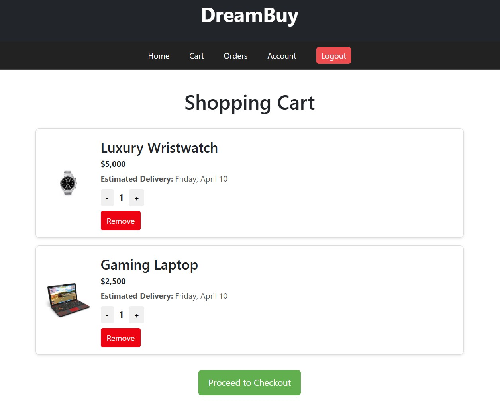
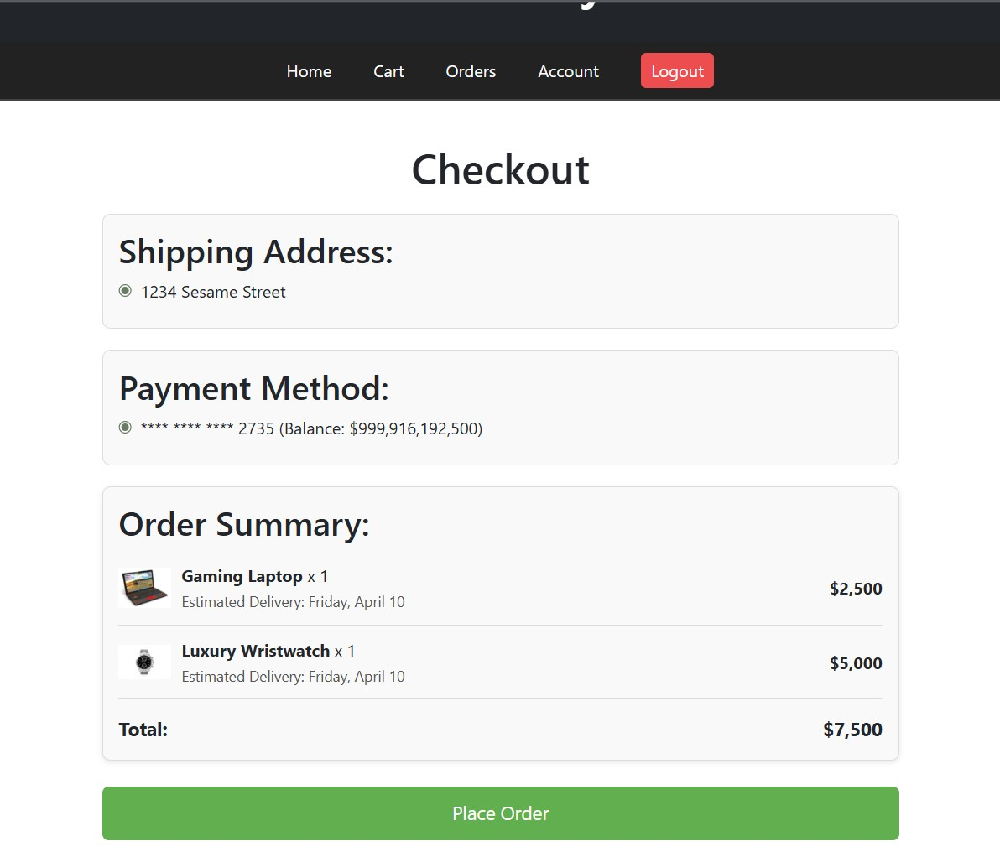

[Back to Portfolio](./)

Testing of an OpenSource GitHub Project
===============

-   **Class: CSCI 452** 
-   **Grade: A** 
-   **Language(s): C** 
-   **Source Code Repository:** [dreamBuyTest](https://github.com/wbcarpenter/dreamBuy/tree/ed4ef710dcc33af892868d6be0840108bbcf3985/client/src/pages)  
    (Please [email me](mailto:wbcarpenter@student.csuniv.edu?subject=GitHub%20Access) to request access.)

## Project description

This project involved performing a structured software‑quality evaluation of DreamBuy, an open‑source full‑stack e‑commerce application. My role was to design and implement a comprehensive automated test suite for the frontend, ensuring that critical user flows remained stable as the project evolved.

I analyzed the existing codebase, identified high‑risk components, and wrote automated tests using Jest, React Testing Library, and Axios mocks. These tests validated authentication, product browsing, cart management, and checkout functionality. I also authored a forward‑looking Maintenance Plan to ensure future features—such as wishlist, coupons, live chat, and notifications—could be added without causing regressions.

This project demonstrates my ability to work with real-world code, design maintainable test strategies, and implement acceptance‑style tests that reflect real user behavior.

## How to run the program

How to compile (if applicable) and run the project.

```bash
cd ./client
npm install
npm test
```

If you wish to run the full DreamBuy application:
```bash
# Terminal 1 – Backend
cd ./server
npm install
npm start

# Terminal 2 – Frontend
cd ./client
npm install
npm start
```

## UI Design

Although this project focused on testing rather than UI creation, the DreamBuy interface includes several user-facing components that were central to the test suit:

### Product Catalog Page

Users can browse, search, filter, and add products to their cart.
Tests validated:
- search filtering
- add-to-cart behavior
- guest-user restrictions

  
Fig 1. Product Catalog interface

### Cart Page

Displays selected items, quantities, and pricing.
Tests validated:
- quantity updates
- item removal
- API interactions

  
Fig 2. Cart interface with item controls

### Checkout Page

Allows users to select shipping address and payment method.
Tests validated:
- form validation
- error messages
- order submission

  
Fig 3. Checkout form with validation feedback

## 3. Additional Considerations

As part of this project, I created a Maintenance Plan outlining how DreamBuy should be tested and maintained as new features are added. The plan identifies critical components (Cart, Login, Checkout, ProductCatalog) and specifies future tests such as:
- Search and filter tests
- Login error‑handling tests
- Cart interaction tests
- Order submission tests

The plan also recommends:
- Running npm test regularly
- Using Git pre‑commit hooks
- Updating mocks and dependencies
- Adding new tests alongside new features

This ensures DreamBuy remains stable and maintainable as the codebase grows.

[Back to Portfolio](./)