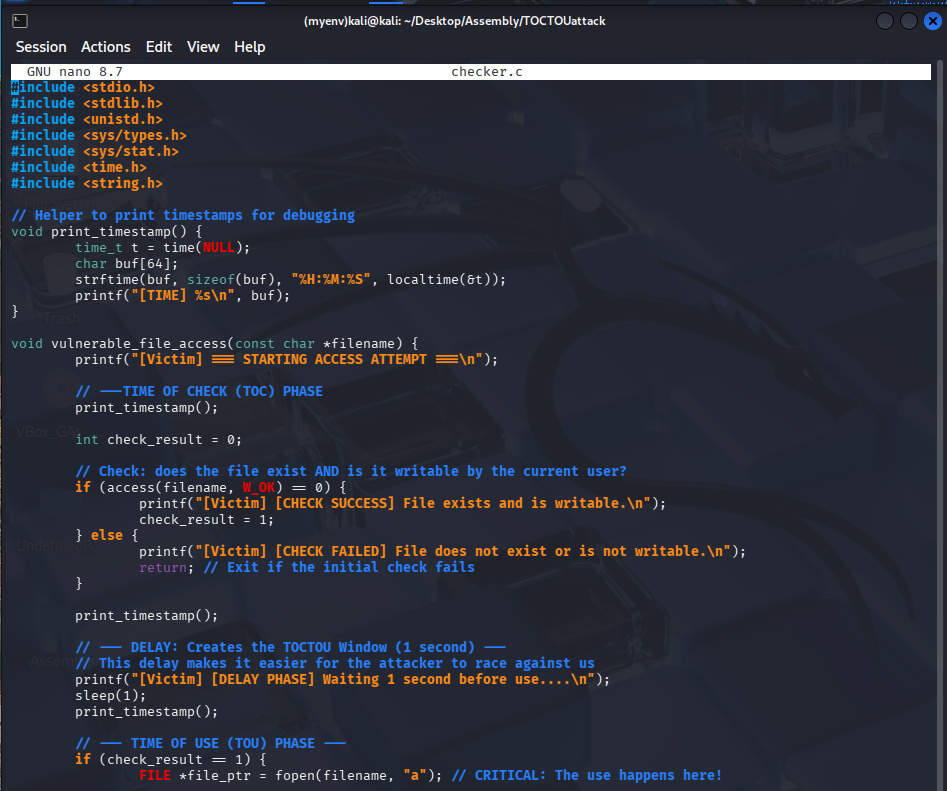
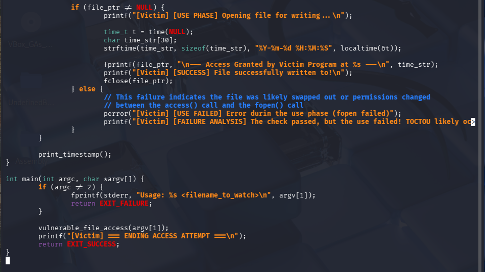
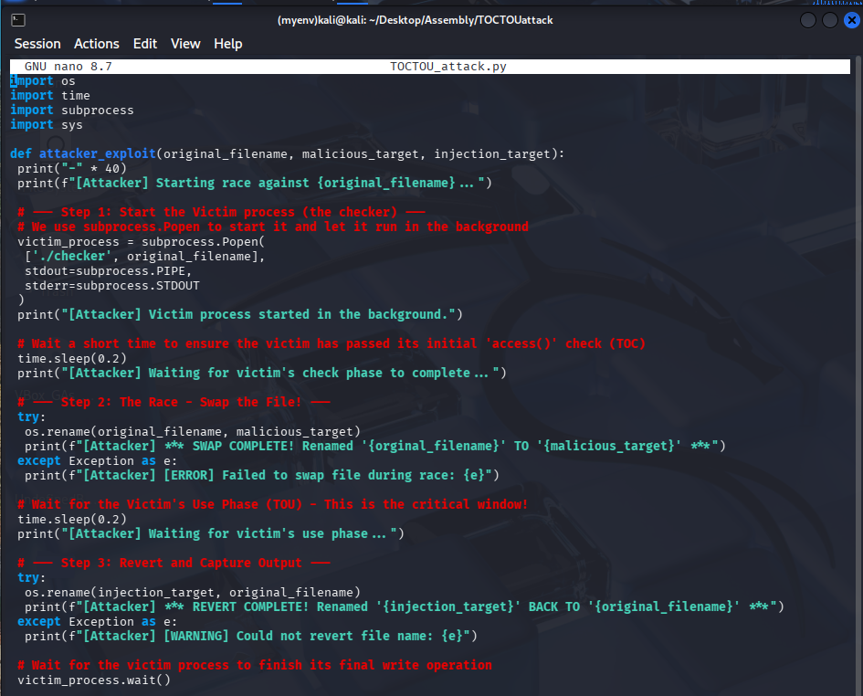
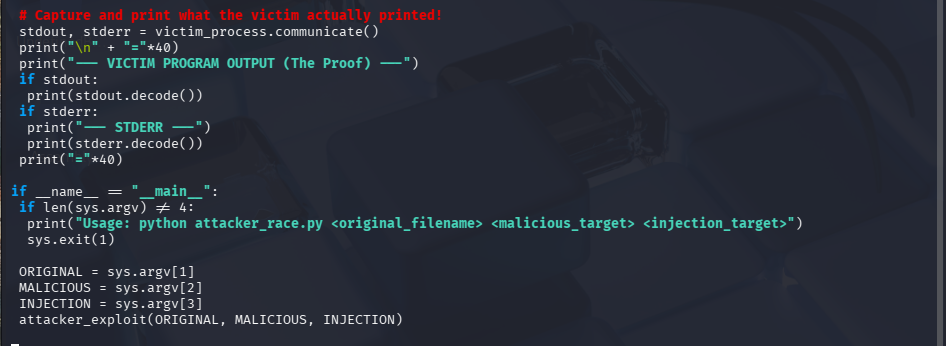
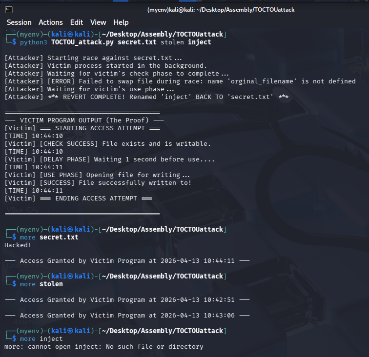

[Back to Portfolio](/index.md)

Time-of-Check to Time-of-Use (TOCTOU) Attack
===============

-   **Class: CSCI 452** 
-   **Grade: A** 
-   **Language(s): C, Python** 
-   **Source Code Repository:** [TOCTOU Attack](https://github.com/wbcarpenter/TOCTOUattack)  
    (Please [email me](mailto:wbcarpenter@student.csuniv.edu?subject=GitHub%20Access) to request access.)

## Project description

This project demonstrates a Time-of-Check to Time-of-Use (TOCTOU) race condition attack in a Linux environment. The goal of the project is to show how improper handling of file access, specifically separating the “check” and “use” phases, can allow an attacker to manipulate a program’s behavior.

The project consists of a vulnerable C program (checker.c) and a Python attack script (TOCTOU_attack.py). The victim program checks whether a file (secret.txt) is writable, pauses briefly, and then writes to it. During this delay, the attacker script replaces the file with a malicious file (inject), causing the victim program to unknowingly operate on the attacker-controlled file.

This demonstrates a real-world class of vulnerabilities that can occur in operating systems and applications that rely on non-atomic file operations.

## How to run the program

This project was originally executed on a Kali Linux Virtual Machine, but it also works in the Windows Command Prompt. The compiled executable for this project is available in the GitHub Releases section.

### Setup Overview
Ensure all files are in the same directory:
checker.c
TOCTOU_attack.py
secret.txt
inject

### Compile the victim program:
```bash
gcc checker.c -o checker
```

### Run the attack script:
```bash
python3 TOCTOU_attack.py secret.txt stolen inject
```

### Notes
- The attack relies on precise timing, so results may vary slightly between runs.
- The program demonstrates the race condition by modifying file contents during execution.
- This should only be run in a controlled lab/VM environment for educational purposes.

## UI Design

This project does not include a traditional graphical user interface. Instead, it uses terminal-based output to demonstrate the interaction between the victim program and the attacker script.

The output logs clearly show:

- The victim’s file access attempt
- The delay window (race condition)
- The attacker’s file swap
- The final result of the exploit

### checker.c


  
Fig 1. The checker.c program simulates a vulnerable application. It performs a file permission check and introduces a delay before using the file, creating the opportunity for exploitation.

### TOCTOU_attack.py


  
Fig 2. The Python script automates the attack by monitoring the victim process and swapping files at the correct moment during execution.

### Successful Program

  
Fig 3. The output demonstrates that the attack was successful. Although the victim program reports normal operation, the contents of secret.txt are altered, showing "Hacked!", proving that the attacker was able to exploit the race condition.

## 3. Additional Considerations

This project highlights the importance of secure coding practices when working with shared resources such as files. Developers should avoid separating security checks from usage and instead rely on atomic operations to prevent race conditions.

One challenge encountered during this project was ensuring proper timing for the attack to succeed consistently. Because race conditions depend on execution timing, multiple test runs and careful tuning were required.

Additionally, this project reinforced the importance of testing software in controlled environments, as exploiting such vulnerabilities on real systems could lead to serious security risks.

[Back to Portfolio](/index.md)