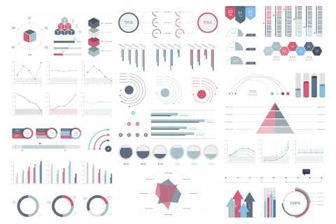

Portfolio
=========

Programming Projects
--------------------

*For access to my private project repositories, please [email me](mailto:example@csustudent.net?subject=GitHub%20Access) with the subject line, GitHub Access.

---
### [SecurePass Honors Senior Project | CSCI 499](SecurePass.md)

---

### [TOCTOU Attack | CSCI 452](project1)

---

### [Applied Networking Website | CSCI 332](project1)

---
### [Testing of an OpenSource GitHub Project | CSCI 540](dreamBuyTest.md)

---

### [Single Cycle Processor | CSCI 330](SCP.md)

---

Ethics Papers
-------------

### [The Deceptive Heart and the Trusted Network: A Reflection on Jeremiah 17:9 in Network Penetration Testing](pdf/NetPenEthicsPaper.pdf)

-   **Class: CSCI 452 Network Penetration Testing and Ethical Hacking** 
-   **Grade: A**

### [The Ethics of Algorithmic Hiring Tools](pdf/AppNetEthicsPaper.pdf)

-   **Class: CSCI 332 Applied Networking** 
-   **Grade: A**

### [Human Factors in Cyber Security](pdf/PrinCyberEthicsPaper.pdf)

-   **Class: CSCI 405 Principles of Cybersecurity**  
-   **Grade: A**

---

Presentations
-------------

### [Exploring Impacts of Generative AI](pdf/ExploringImpactofGenerativeAI.pdf)

- **Class: CSCI 402 Research I** 
- **Grade: A**
- **Video: [video presentation link](https://youtu.be/UNUUsSfW29o?si=oaI0SXG6EfjP-CYY)**

### [Creative Teamwork Peru Trip](pdf/CreativeTeamwork.pdf)

- **Class: CSCI 383** 
- **Grade: A**

---

Page template forked from <a href="https://github.com/csu-cs/csci-portfolio">CSU-CS</a>

<!-- Remove above link if you don't want to attributive -->
